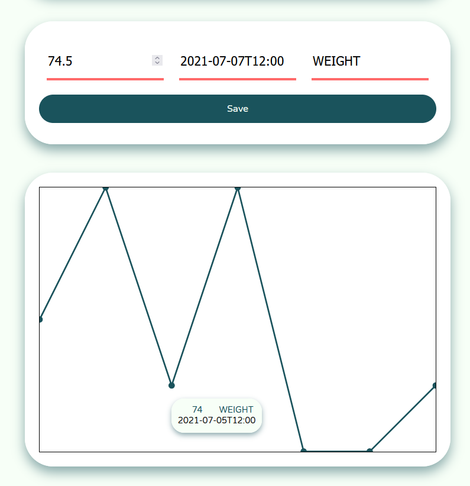

# Mensuret Eundo: _Measuring as it Goes_

Mensuret Eundo is an SPA for measuring weight, happiness, daily income, or any other time-dependent metric.

Built on [Node v16.8.0](https://nodejs.org/en/blog/release/v16.8.0/) using [TypeScript](https://www.typescriptlang.org/), [Express](https://expressjs.com/), [Sass](https://sass-lang.com/), and [React](https://reactjs.org/). Created as part of an interview test on a rainy Sunday.

# Usage

TLDR: `npm run build` to compile, then `npm run start` to start a local HTTP/HTTPS server (accessible at [http://localhost](http://localhost) or [https://localhost](https://localhost)).

The React client is built with [webpack](https://webpack.js.org/) (run `webpack --mode=production`). The Express server is compiled by TypeScript (run `tsc`). The NPM package includes both of these as a single script, which can be run with `npm run build` (or `npm run build-dev`, to run webpack in development mode). The compiled module can be executed by Node with `node .`, or with `npm run start`. This starts an HTTP and HTTPS server running locally, at [http://localhost](http://localhost) or [https://localhost](https://localhost) respectively. Expect some warning about self-signed certificates when accessing the project via HTTPS, because, well, the certificates are self-signed.

The project includes a [Dockerfile](./Dockerfile), enabling containerization via [Docker](https://www.docker.com/) by first building the image (`docker build . -t mensureteundo`) and then running a port-bound container (`docker run -p 80:80 -p 443:443 mensureteundo`). Consider also including environment variables for the email service, and a volume for the database. If you find that installing an entire operating system and its corresponding emulator is preferable to installing and configuring Node (which it might well be), this is the option for you.

# Example

# Potential Improvements

- See also: all comments marked `TODO` in [server.ts](./server/server.ts) and [index.tsx](./client/index.tsx).

- Asynchronous system design, especially for database operations and mail.

- Including [Certbot](https://certbot.eff.org/) to generate and renew SSL certificates, rather than relying on the self-signed (and exposed) certificates in this repository.

- Consideration for timezones (at present, all timestamps are in UTC).

- Design and UX, responsiveness.

- Environment variable handling for server-sent mails.

- General refactoring, code quality.
